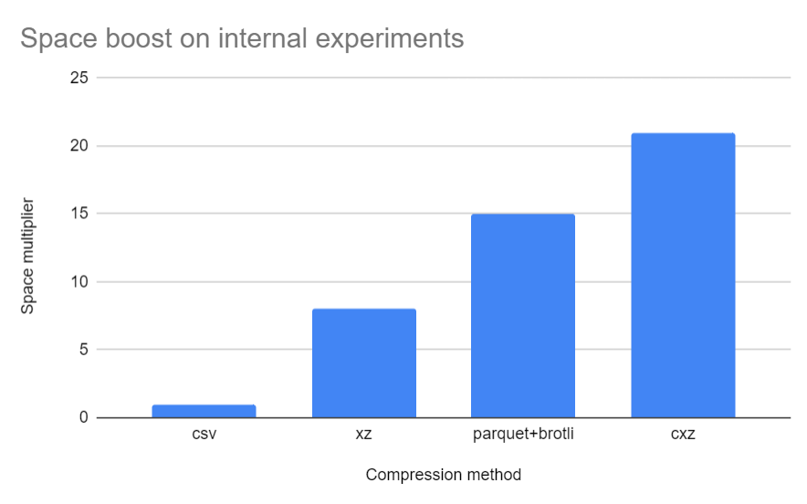

# CXZ: CSV compression optimization
Simple trick to **almost double** the compression of LMZA algorithm on CSV files. It also **outperforms (pandas) Parquet + Brotli** in compression size, but not in speed.
```
python3 cxz.py [c | d] [input file] [output file]
```
